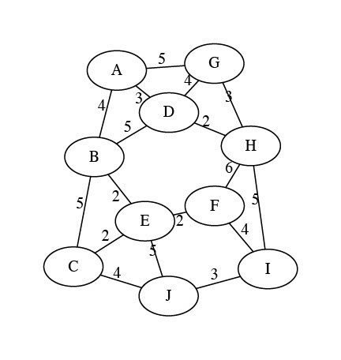
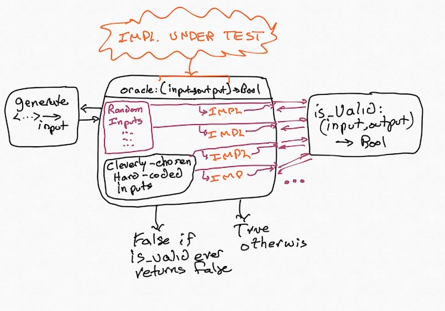

## From Tests to Properties 

<!-- Other examples we could include

Implementation of a linked list. 
* What should `add` guarantee?

* change-making 
  * simple greedy algorithm (largest coins first)
  * apply PBT (correct total, in drawer)
  * let's try this on LLM-generated code

 -->

For now, let's go back to testing. Most of us have learned how to write test cases. Given an input, here's the output to expect. Tests are a kind of pointwise *specification*; a partial one, and not great for fully describing what you want, but a kind of specification nonetheless. They're cheap, non-trivially useful, and better than nothing.

But they also carry our biases, they can't cover an infinite input space of inputs. Even more, they're not always adequate carriers of intent: if I am writing a program to compute the statistical median of a dataset, and write `assert median([1,2,3]) == 2`, what exactly is the behavior of the system I'm trying to confirm? Surely I'm not writing the test because I care specifically about `[1,2,3]` only, and have no opinion about `[3,4,5]` in the same way? Maybe there was some broader aspect, some _property_ of median I cared about when I wrote that test. 

**Exercise:** What do you think it was? What makes an implementation of `median` correct?

??? note "Think, then click!"
    There might be many things! One particular idea is that, if the input list has odd length, the median needs to be an element of the list. Or that, once the set is sorted, the median should be the "middle" element.


---

There isn't always an easy-to-extract property for every unit test. But this idea&mdash;encoding _goals_ instead of specific behaviors&mdash;forces us to start thinking critically about _what exactly we want_ from a system and helps us to express it in a way that others (including, perhaps, LLMs) can better use. It's only a short hop from there to some of the real applications we talked about last time, like verifying firewalls or modeling the Java type system.

!!! note "Sometimes, you can test exhaustively!"
    Sometimes the input space is small enough that exhaustive testing works well. This blog post, entitled ["There are only four billion floats"](https://news.ycombinator.com/item?id=34726919) is an example.

    Depending on your experience, this may also be a different kind from testing from what you're used to. Building a repertoire of different tools is essential for any engineer!


### A New Kind of Testing

#### Example: Path Finding

Consider the problem of finding paths in a graph. There are quite a few algorithms you might use: Breadth-First Search, Depth-First Search, and so on. 

The problem statement seems simple: take a graph $GRAPH$ and two vertex names $V1$ and $V2$ as input. Produce either a path from $V1$ to $V2$ in $GRAPH$ or indicate that no such path exists. But it turns out that this problem hides a lurking issue.

**Exercise:** Find a path from vertex $G$ to vertex $E$ on the graph below. 



??? note "Think, then click!"
    The path is G to A to B to E.    

    Great! We have the answer. Now we can go and add a test case for with that graph as input and (G, A, B, E) as the output. 

    Wait -- you found a different path? G to D to B to E? Or G to H to F to E? Oh, no... (Those are all the same total cost, too! So if we were finding cheapest paths, we'd have the same problem.)

---

If we add a traditional test case corresponding to _one_ of the correct answers, our test suite will falsely raise alarms for correct implementations that happen to find different answers. In short, we'll be over-fitting our tests to _one specific implementation_: ours. But there's a fix. Maybe instead of writing:

`search(GRAPH, G, E) == [(G, A), (A, B), (B, E)]`

we write:

```
search(GRAPH, G, E) == [(G, A), (A, B), (B, E)] or
search(GRAPH, G, E) == [(G, D), (D, B), (B, E)] or
search(GRAPH, G, E) == [(G, H), (H, F), (F, E)]
```

**Exercise:** What's wrong with the "big or" strategy? Can you think of a graph where it'd be unwise to try to do this?

??? note "Think, then click!"
    There are at least two problems. First, we might have missed some possible solutions, which is quite easy to do; the first time I was writing these notes, I missed the third path above! Second, there might be an unmanageable number of equally correct solutions. The most pathological case might be something like a graph with all possible edges present.

---

This problem&mdash;multiple correct answers&mdash;occurs in every part of Computer Science. Once you're looking for it, you can't stop seeing it. Most graph problems exhibit it. Worse, so do most optimization problems. Unique solutions are convenient, but the universe isn't built for our convenience. We call such problems _relational_, because the relationship between inputs and outputs isn't a function in the mathematical sense.

**Exercise:** What's the solution? If _test cases_ won't work, is there an alternative? instead of defining correctness in terms of input-output pairs, think top-down: what does it __mean__ for an output to be correct?

??? note "Think, then click!"
    To be correct, an output path needs to:
    
    - start at the correct node;
    - end at the correct node; and
    - follow actual edges in the graph, instead of inventing new ones.
    
---

<!-- The first three are easy enough to check. We just write a program that accepts _both_ the input and output, checks equality on the start and end nodes, and then runs a `for` loop to make sure the output path's edges exist.
    
    We've already made progress! The fourth requirement is harder, though: we can't easily write an efficient program that checks _all_ possible other paths. Fortunately, in the cheapest-path case, the costs of all cheapest paths are the same. This enables us to write someething like this in our test suite:

    `cost(cheapest(GRAPH, G, E)) = 11`

    The key is that we can combine all four subproperties in each test case: start, end, edges, and minimality. Then we don't need to hard-code an output at all, and our tests are robust against multiple implementations of `cheapest`.  -->


<!-- 
This might be something you were taught to do when implementing cheapest-path algorithms, or it might be something you did on your own, unconsciously. (You might also have been told to ignore this problem, or not told about it at all. When I learned Dijkstra's algorithm, we tested only the lengths and not the actual paths at all.) We're not going to stop there, however. -->

We just did something subtle and interesting. Our testing strategy has just evolved past naming _specific_ values of output to checking broader _properties_ of output: the path starts at the correct place, follows actual edges in the graph, and so on. We don't need to know the output path itself, only certain facts about it. Not: "This is the answer." Rather: "This is what a correct answer looks like."

<!-- Similarly, we can move past specific inputs: randomly generate them. Then, write a function `is_valid` that takes an arbitrary `input, output` pair and returns true if and only if the output is a valid solution for the input. Just pipe in a bunch of inputs, and the function will try them all. You can apply this strategy to most any problem, in any programming language. (For your homework this week, you'll be using Python.) Let's be more careful, though.

**Exercise:** Is there something _else_ that `cheapest` needs to guarantee for that input, beyond finding a path with the same cost as our solution?

??? note "Think, then click!"
    We also need to confirm that the path returned by `cheapest` is indeed a path in the graph!


--- -->

**Exercise:** Now take that list of goals, and see if you can outline a function that tests for it. Remember that the function should take the problem input (in this case, a graph and the source and destination vertices) and the output (in this case, a path). You might generate something like this:

??? note "Think, then click!"
    ```
    def validate_path(graph: dict, start, end, path: list) -> bool:
    if not path:
        return False
    if path[0] != start or path[-1] != end:
        return False
    for i in range(len(path) - 1):
        if path[i] not in graph or path[i + 1] not in graph[path[i]]:
            return False
    return True
    ```

Notice how these kinds of tests can be pretty straightforward to write. Indeed, I "wrote" this with Claude Code. The trick is in accurately describing the properties you care about.

---

This style of testing is called Property-Based Testing (PBT). There's a variation that uses a trusted implementation&mdash;or some other artifact&mdash;as a source of truth to evaluate the output, sometimes called Model-Based Testing (MBT). 

!!! note "Model-Based Testing"
    There are _many_ techniques under the umbrella of MBT. A model can be another program, a formal specification, or some other type of artifact that we can "run". Often, MBT is used in a more stateful way: building a model to help generate sequences of user interactions that drive the system into interesting states. As you might imagine, many people disagree on what "real" PBT and "real" MBT are.

    I don't think it's useful to dive into that debate. For now, just know that modeling systems and thinking about properties more formally can be helpful in generating good tests.


There are a few questions, though...

**Question:** You said we could test a new implementation against another one. But can we really trust a "trusted" implementation?

No, not completely. It's impossible to reach a hundred percent trust; anybody who tells you otherwise is selling something. Even if you spend years creating a correct-by-construction system, there could be a bug in (say) how it is deployed or connected to other systems. 

But often, questions of correctness are really about the _transfer of confidence_: my old, slow implementation has worked for a couple of years now, and it's probably mostly right. I don't trust my new, optimized implementation at all: maybe it uses an obscure data structure, or a language I'm not familiar with, or maybe I don't even have access to the source code at all. 

And anyway, often we don't need recourse to any trusted model; we can just phrase the properties directly. 

### Input Generation

Now that we've avoided writing hard-coded outputs in our tests, you might wonder: _Where do the inputs come from_? Great question! Some we will manually create based on our own cleverness and understanding of the problem. **You should still write hand-crafted, carefully-curated unit tests.**

Others, we'll generate randomly. Random inputs are used for many purposes in software engineering: "fuzz testing", for instance, creates vast quantities of random inputs in an attempt to find crashes and other serious errors. We'll use that same idea here, except that our notion of correctness is usually a bit more nuanced.

Concretely:



It's important that some creativity is still involved here. You need to come up with an `is_valid` function (the "property"), and you'll almost always want to create some hand-crafted inputs (don't trust a random generator to find the subtle corner cases you already know about!) The strength of this approach lies in its resilience against problems with multiple correct answers, and in its ability to _mine for bugs while you sleep_. Did your random testing find a bug? Fix it, and then add that input to your list of regression tests. Rinse, repeat.

If we were still thinking in terms of traditional test cases, this would make no sense: where would the outputs come from? Instead, we've created a testing system where concrete outputs aren't something we need to provide. Instead, we check whether the program under test produces _any valid output_.

### The Hypothesis Library

There are PBT libraries for most every popular language. In this book, we'll be using a library for Python called [Hypothesis](https://hypothesis.readthedocs.io/en/latest/index.html). Hypothesis has many helper functions to make generating random inputs relatively easy. It's worth spending a little time stepping through the library. Let's test a function in Python itself: the `median` function in the `statistics` library, which we began this chapter with. What are some important properties of `median`?

Now let's use Hypothesis to test at least one of those properties. We'll start with this [template](./pbt.py):

```python
from hypothesis import given, settings
from hypothesis.strategies import integers, lists
from statistics import median

# Tell Hypothesis: inputs for the following function are non-empty lists of integers
@given(lists(integers(), min_size=1)) 
# Tell Hypothesis: run up to 500 random inputs
@settings(max_examples=500)
def test_python_median(input_list):    
    pass

# Because of how Python's imports work, this if statement is needed to prevent 
# the test function from running whenever a module imports this one. This is a 
# common feature in Python modules that are meant to be run as scripts. 
if __name__ == "__main__": # ...if this is the main module, then...
    test_python_median()

```

Let's start by filling in the _shape_ of the property-based test case:

```python
def test_python_median(input_list):    
    output_median = median(input_list) # call the implementation under test
    print(f'{input_list} -> {output_median}') # for debugging our property function
    if len(input_list) % 2 == 1:
        assert output_median in input_list 
    # The above checks a conditional property. But what if the list length isn't even?
    # We should be able to do better!
```

**Exercise**: Take a moment to try to express what it means for `median` to be correct in the language of your choice. Then continue on with reading this section.

Expressing properties can often be challenging. After some back and forth, we might reach a candidate function like this:

```python
def test_python_median(input_list):
    output_median = median(input_list)
    print(f'{input_list} -> {output_median}')
    if len(input_list) % 2 == 1:
        assert output_median in input_list
    
    lower_or_eq =  [val for val in input_list if val <= output_median]
    higher_or_eq = [val for val in input_list if val >= output_median]
    assert len(lower_or_eq) >= len(input_list) // 2    # int division, drops decimal part
    assert len(higher_or_eq) >= len(input_list) // 2   # int division, drops decimal part
```

Unfortunately, there's a problem with this solution. Python's `median` implementation _fails_ this test! Hypothesis provides a random input on which the function fails: `input_list=[9502318016360823, 9502318016360823]`. Give it a try! This is what _my_ computer produced; what happens on yours?

Exercise: **What do you think is going wrong?**

??? note "Think, then click!"
    Here's what my Python console reports:
    ```python
    >>> statistics.median([9502318016360823, 9502318016360823])
    9502318016360824.0
    ```

    I really don't like seeing a number that's larger than both numbers in the input set. But I'm also suspicious of that trailing `.0`. `median` has returned a `float`, not an `int`. That might matter. But first, we'll try the computation that we might expect `median` to run:

    ```python
    >>> (9502318016360823*2)/2
    9502318016360824.0
    ```

    What if we force Python to perform _integer_ division?

    ```python
    >>> (9502318016360823*2)//2
    9502318016360823
    ```

    Could this be a floating-point imprecision problem? Let's see if Hypothesis can find another failing input where the values are smaller. We'll change the generator to produce only small numbers, and increase the number of trials hundredfold:

    ```python
    @given(lists(integers(min_value=-1000,max_value=1000), min_size=1))
    @settings(max_examples=50000)
    ```

    No error manifests. That doesn't mean one _couldn't_, but it sure looks like large numbers make the chance of an error much higher. 

    The issue is: because Python's `statistics.median` returns a `float`, we've inadvertently been testing the accuracy of Python's primitive floating-point division, and floating-point division is [known to be imprecise](https://docs.python.org/3/tutorial/floatingpoint.html) in some cases. It might even manifest differently on different hardware&mdash;this is only what happens on _my_ laptop!

    Anyway, we have two or three potential fixes: 
      - bound the range of potential input values when we test; 
      - check equality within some small amount of error you're willing to tolerate (a common trick when writing tests about `float` values); or 
      - change libraries to one that uses an arbitrary-precision, like [BigNumber](https://pypi.org/project/BigNumber/). We could adapt our test fairly easily to that setting, and we'd expect this problem to not occur. 

    Which is best? I don't really like the idea of arbitrarily limiting the range of input values here, because picking a range would require me to understand the floating-point arithmetic specification a lot more than I do. For instance, how do I know that there exists some number $x$ before which this issue can't manifest? How do I know that all processor architectures would produce the same thing? 

    Between the other two options (adding an error term and changing libraries) it depends on the engineering context we're working in. Changing libraries may have consequences for performance or system design. Testing equality _within some small window_ may be the best option in this case, where we know that many inputs will involve `float` division.

### Another Example

The path-finding example is a bit simplistic, so here's another: does an encryption or hash function produce very different ciphertexts for two very similar plaintexts? This is called the [avalanche property](https://en.wikipedia.org/wiki/Avalanche_effect). For instance, if I run [`md5`](https://en.wikipedia.org/wiki/MD5) on two inputs: "Hello World" and "Hello World!" I really ought to get results that are far apart. If I put those strings into separate files, here's what I get:

```
% md5 hello1.txt 
MD5 (hello1.txt) = b10a8db164e0754105b7a99be72e3fe5
% md5 hello2.txt
MD5 (hello2.txt) = ed076287532e86365e841e92bfc50d8c
```

These differ on 73 of 128 bits, so this is fine. Whew. But does this always happen? We might try looking for counterexamples via PBT: randomly generate a string (`str_orig`), mutate it by one character (`str_modified`), run `md5` on both, and compute the distance between the resulting hashes. 

Here is [a proof-of-concept Python program](./hash_avalanche_pbt.py) demonstrating the idea. `md5` doesn't do too badly if we only ask for 25% difference, but it should fail with a counterexample at the 50% difference we usually aim for in cryptography. PBT can be very useful for discovering bugs like this, although _failure to find a counterexample is not a proof of correctness!_

### Takeaways

We'll close this section by noticing two things:

First, being precise about _what correctness means_ is powerful. With ordinary unit tests, we're able to think about behavior only _point-wise_. Here, we need to broadly describe our goals, and there's a cost to that, but also advantages: comprehensibility, more powerful testing, better coverage, etc. And we can still get value from a partial definition, because we can then at least apply PBT to that portion of the program's behavior. 

Second, the very act of trying to precisely express, and test, correctness for `median` _taught us (or reminded us about) something subtle about how our programming language works_, which tightened our definition of correctness. Modeling often leads to such a virtuous cycle. 

!!! note "Related Readings"
    [Choosing Properties for Property-Based Testing](https://fsharpforfunandprofit.com/posts/property-based-testing-2/), part of a series on PBT. The post is a decade old, but still full of useful wisdom. It should give you a few general shapes to consider: round-trip properties, idempotence, etc. It's not exhaustive, but you'll want to read it. 

    Hillel Wayne has a related post on [Metamorphic Testing](https://www.hillelwayne.com/post/metamorphic-testing/), which extends some of the ideas of PBT to cover properties like: "the speech-to-text engine should give the same output if the input volume changes".

    Our industry-related reading is an AWS Security blog post: [How AWS uses automated reasoning to help you achieve security at scale](https://aws.amazon.com/blogs/security/protect-sensitive-data-in-the-cloud-with-automated-reasoning-zelkova/). I'm choosing something from AWS in 2018 to demonstrate that solver-based FM has been around for a while, and that companies like Amazon build products based on FM. The tool that the post talks about uses the ideas you'll learn in this book, specifically that security policies can be encoded as a constraint-solving problem.

!!! note "For CSCI 1710: Avatars"
    If you're taking this course at Brown, we're going to ask you to start thinking about an "avatar" for your work in 1710. This idea is inspired by, and borrows most of the following text from, Prof. Valles' work in Physics 1530 at Brown: *"Create your Avatar at the start of the semester by writing an autobiography (of one paragraph) that describes the field or scenario that you are interested in learning more about. Feel free to be creative. You will probably find that your Avatar will need modifications or adjustments over the course of the semester and it is okay for you to alter it while keeping the same major theme."* For example, you might invent Dusty the Distributed-Systems Engineer, Orion the Object-Oriented Architect, or someone similar. You'll be using your avatar for some of the upcoming assignments and in-class exercises.  