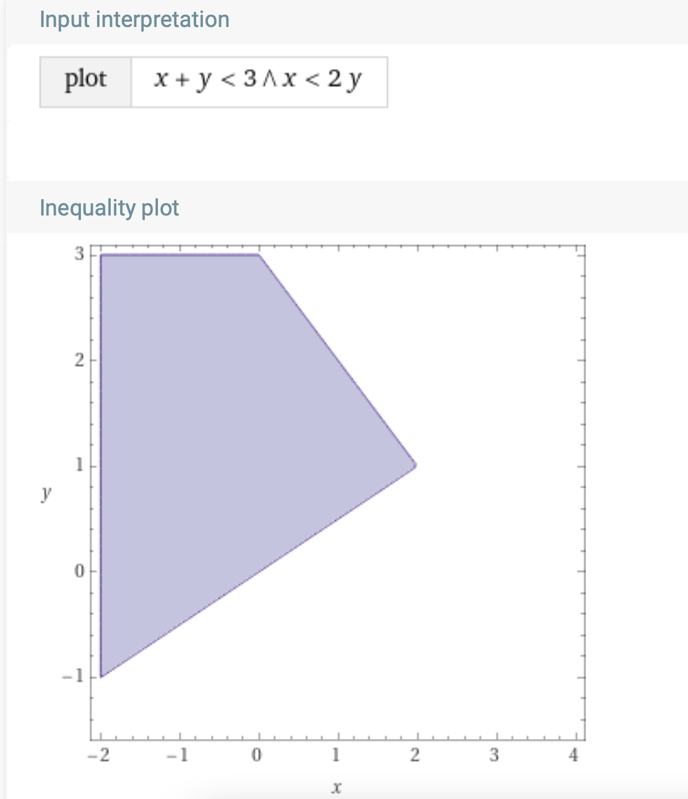
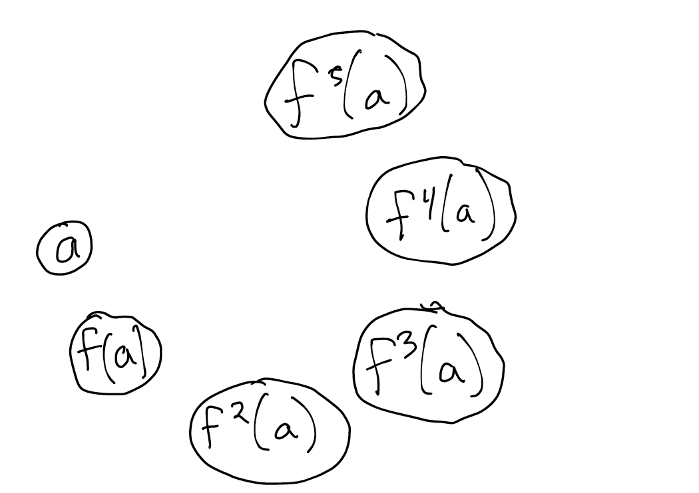
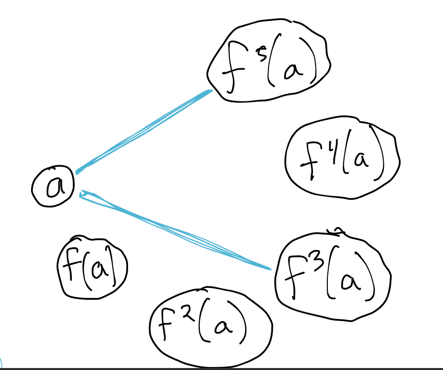
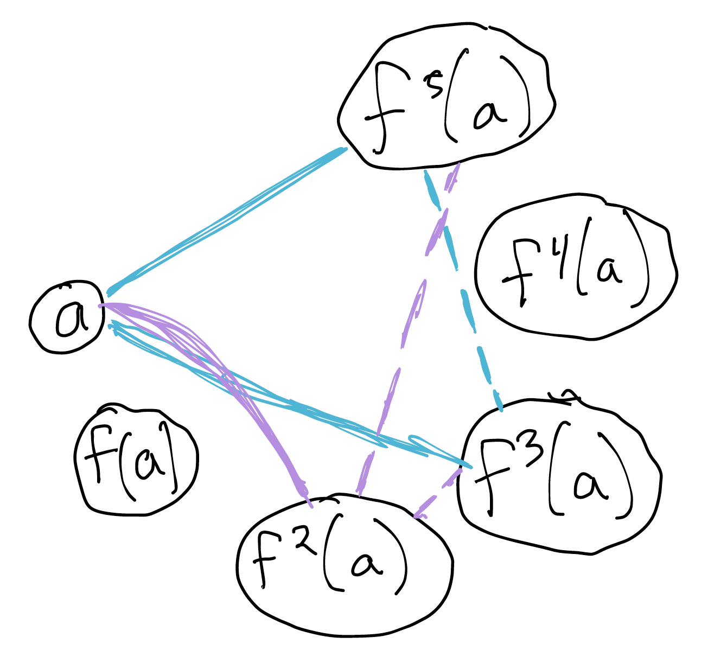
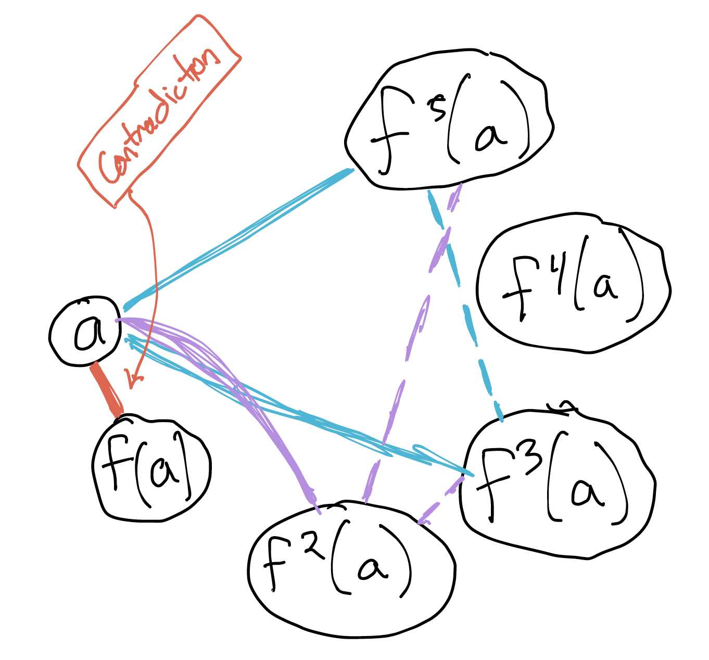

# Satisfiability Modulo Theories (SMT)

[Livecode link](./z3demo.py)

Boolean solvers are powerful, but not very expressive *on their own*. If you want to use them to solve a problem involving (e.g.)  arithmetic, you need to encode that idea with booleans. Forge does this with a technique called "bit-blasting": one boolean variable per bit in a fixed bitwidth, along with formulas that build boolean adders, multipliers, etc. as needed. This works well for small examples, but can quickly run into performance issues&mdash;and if you need actual mathematical integers (to say nothing of real numbers!) you're out of luck.

An SMT solver is a SAT solver that can handle various domain-specific concepts beyond boolean logic. Hence "modulo theories", where "modulo" means "with respect to". SMT solvers solve satisfiability, but with the addition of (say) the theory of linear integer arithmetic or the theory of strings.

From a certain point of view, Forge is an "SMT" solver, because it includes concepts like relations and bit-vector integers. But this isn't usually how people understand the term these days. 

SMT solvers can be either "eager" or "lazy". An eager solver translates all the domain-specific constraints to boolean logic and then uses a boolean solver engine. That is Forge's approach. In contrast, a lazy solver actually implements domain-specific algorithms and integrates those with a purely-boolean solver core. 

Most modern SMT solvers tend to be lazy, and so they can benefit from clever domain algorithms. (Why encode prime factorization in booleans, if you have a solver that can do algebra?)

!!! note "Theories"
    In the logic community, _theory_ is just another word for set of constraints. So when we say "the theory of linear integer arithmetic" we mean the axioms that define the domain of linear integer arithmetic.

Here are some common domains that SMT solvers tend to support:

* uninterpreted functions with equality;
* integer arithmetic (linear nearly always, non-linear often);
* real arithmetic;
* lists and algebraic datatypes;
* strings;
* bit vectors; and
* arrays.

Of course, there are many others implemented in various solvers. The solver we'll use, Z3, supports many of the above. Z3 also supports optimization. While Forge does too, we haven't optimized for it. So if you want to find optimal solutions to a problem, an SMT solver is worth trying!

### A Key Difference: Universal Quantifiers

Most modern SMT solvers don't have "bounds" in the same way Forge does. You can declare a datatype that's bounded in size, but the engine doesn't process that in the same way that Forge does. And the addition of domains like mathematical integers or lists means that the set of possible objects is infinite. This complicates universal (`all`) quantification.

What does it mean to say "For all $x$ of type $A$, $P(x)$ is true?" In Forge, $A$ always has an upper bound, and so the quantifier can always be converted to a big, but finite, "`and`" constraint. But suppose the type is actual _mathematical integers_? There are infinitely many integers, which means the solver can't convert the quantifier to a (finite) boolean constraint. This is such an important factor in designing SMT solvers that SMT literature often refers to universal quantification as just "quantification". 

!!! warning "Universal quantification"
    **For now**, try to avoid universal quantification in SMT if you can. You can't always avoid it, but make sure you really need it to express your goals.


Universal quantification isn't the only issue. Even without it, the domain-specific algorithms the solver uses might not be guaranteed to terminate. Because of this, the solver is always working under a timeout. If the solver times out, it will give a new result type, other than "sat" and "unsat": "_unknown_".

!!! info "Undecidability"
    The "unknown" result is a consequence of the fact that some of the problems SMT solvers can express are _undecidable_: it is impossible to produce an always-correct, always-terminating algorithm to solve the general case. One example of this is: given a non-linear polynomial, [does it have an all-integer solution](https://en.wikipedia.org/wiki/Hilbert%27s_tenth_problem)?

## The Z3 Solver

Let's first step through some of the new things we can express with an SMT solver.

### Setup

We'll be using the Python bindings for the Z3 solver, available [here](https://pypi.org/project/z3-solver/). You can also install via `pip`:

`pip3 install z3-solver`

To update to the latest version of the solver, you can run:

`pip3 install z3-solver --upgrade`

Another great solver is [cvc5](https://cvc5.github.io). Although we won't use it in class, it supports some things that Z3 doesn't (and vice versa). (For instance: cvc5 supports Forge-style relations!)

### Boolean

We've still got the boolean-logic capabilities of a normal SAT solver:

```python 
def demoBool():
        # Create a new solver
        s = Solver()

        # declare some boolean *solver* variables
        p, q = Bools('p q')         
        
        s.add(Or(p, q))
        if s.check() == sat:        
            print(s.model()) # "model" ~= "instance" here. see below.
        
        # (Think: how would we get a different solution?)

        # getting at pieces of a model for programmatic use
        print(s.model().evaluate(p)) # can pass a formula              
```

When we run this, we get:
```
[p = True, q = False]
True
```

!!! warning "Terminology Warning"
    Different communities use different terminology. In this book, we use the word _model_ to describe the definitions and constraints you use to model a system, just like an automotive engineer might build a computer model of a car. This is generally what the software-engineering community means by the word. 

    The logic community, on the other hand, uses _model_ to mean the same thing that we call an _instance_ in Forge: the valuation that either satisfies or dissatisfies a set of constraints.  For now, just be aware that Z3 will use the word "model" like a logician, not a software engineer.


### Uninterpreted Functions And Integer Inequalities

If a symbol (function, relation, constant, ...) is _interpreted_, then its meaning is encoded via constraints built into the solver. In Forge, we'd say that:

* `add` is an interpreted function, since Forge assigns it a meaning innately; but
* relations you add as sig fields are uninterpreted, since without constraints you add yourself, Forge treats their values as arbitrary.

!!! warning "Functions, not relations"
    SMT solvers usually focus on functions, not relations. This is another reason for Froglet to be about functions: they're more useful as a foundation in other tools!

Here is a Z3 demo that demonstrates the difference between interpreted and uninterpreted functions:

```python
def demoUninterpreted():
    s = Solver()
    # Solver variables: Ints and an uninterpreted functions 
    a, b = Ints('a b')  
    f = Function('f', IntSort(), IntSort())

    s.add(And(b > a, f(b) < f(a)))        
    if s.check() == sat:        
        print(s.model()) 
        print(s.model().evaluate(f(a)))
        print(s.model().evaluate(f(b)))
        print(s.model().evaluate(f(1000000)))
```

When we run this, we get:
```
[b = 1, a = 0, f = [0 -> 0, else -> -1]]
0
-1
-1
```

Notice how the solver is reporting the function. It's not a table like it would be in Forge, but something much more like an if-then-else.

### Numbers: Integers vs. Reals

Let's try something that involves arithmetic, and also explore how the solver handles real numbers vs. integers. Here's a small example of how numbers work in Z3:

```python
def demoReals():
    s = Solver()
    x = Real('x') 
    s.add(x*x > 4)
    s.add(x*x < 9)
    result = s.check()
    if result == sat:
        print(s.model())    
    else: 
        print(result)
```

When we run this, we get an answer. But if we change the `Real` to `Int`, we won't because there is no integer between 2 and 3. 

### Factoring

Here's another example: factoring polynomials. 

We could use a universal quantifier here, but perhaps we don't need one. How we frame the problem can drastically affect how Z3 performs&mdash;in cases like this, the solver can often automatically handle the quantifier. But not always.

```python
def demoFactoringIntWithUniversal():
    s = Solver()

    # (x - 2)(x + 2) = x^2 - 4
    # Suppose we know "x^2 - 4" and want to factor it. 
    # We will solve for the roots:
    # (x - ROOT1)(x + ROOT2) = x^2 - 4

    xi, r1i, r2i = Ints('x root1 root2') # int vars

    # Note: I'm using * instead of exponentiation here, because in 2025 exponentiation 
    # didn't work very well when I ran this problem. It might be fine, now! 
    s.add(ForAll(xi, (xi + r1i) * (xi + r2i) == (xi * xi) - 4  ))
    result = s.check()
    if result == sat:
        print(s.model())    
    else: 
        print(result)

    s.reset()   

    # Try another one: 
    # (x + 123)(x - 321) = x^2 - 198x - 39483
    s.add(ForAll(xi, (xi + r1i) * (xi + r2i) 
                     == (xi * xi) + (198 * xi) - 39483))
    result = s.check()
    if result == sat:
        print(s.model())    
    else: 
        print(result)
    # Note how fast, even with numbers up to almost 40k. Power of theory solver.


!!! info "Exercise" 
    Could we use SMT to factor a polynomial _without_ using universal quantification over `x`?

def demoFactoringReals():
    s = Solver()
    x, r1, r2 = Reals('x root1 root2') # real number vars
    # ^ As before, solve for r1, r2 because they are unbound in outer constraints
    #   x is quantified over and therefore not a var to "solve" for

    # (x + ???)(x + ???) = x^2 - 198x - 39484         
    s.add(ForAll(x, (x + r1) * (x + r2) 
                     == (x * x) + (198 * x) - 39484))
    result = s.check()
    if result == sat:
        print(s.model())    
    else: 
        print(result)
```

### Unsatisfiable Cores

Let's try the same problem, but with a polynomial without any real roots. We should expect unsat (and indeed that's what we get). But can we get more than "unsat" out of the solver?

In Forge, you can get [an unsatisfiable core](https://forge-fm.github.io/forge-documentation/latest/running-models/options/): a _subset_ of the constraints that is, itself, unsatisfiable. Z3 provides the same: 

```python
def demoFactoringRealsUnsat():
    s = Solver()

    # Here's how to start using cores in Z3 if you want, but
    # see the docs -- it's a bit more annoying because you need to create 
    # new boolean variables etc.

    s.set(unsat_core=True) # there are so many options, at many different levels

    x, r1, r2 = Reals('x root1 root2') # real number vars

    # Note e.g., x^2 - 2x + 5 has no real roots (b^2 - 4ac negative)
    # To enable core extraction, we need to name every top-level constraint we want to blame
    s.assert_and_track(ForAll(x, (x + r1) * (x + r2) 
                             == (x * x) - (2 * x) + 5), 'constr1')

    result = s.check() 
    if result == sat:
        print(s.model())    
    else: 
        print(result)
        # Note: it's a method of the solver, not the result. 
        print(s.unsat_core())         
```

### Another Demo: N-Queens

```python
   def nQueens(numQ):
        s = Solver()
        # Model board as 2d list of booleans. Note the list is *Python*, booleans are *Solver*
        cells = [ [ z3.Bool("cell_{i}{j}".format(i=i,j=j)) 
                    for j in range(0, numQ)] 
                    for i in range(0, numQ) ]
        #print(cells)
        
        # a queen on every row
        queenEveryRow = And([Or([cells[i][j] for j in range(0, numQ)]) for i in range(0, numQ)])
        #print(queenEveryRow) # for demo only
        s.add(queenEveryRow)

        # for every i,j, if queen present there, implies no queen at various other places
        # Recall: queens can move vertically, horizontally, and diagonally.
        # "Threaten" means that a queen could capture another in 1 move. 
        queenThreats = And([Implies(cells[i][j], # Prefix notaton: (And x y) means "x and y".
                                    And([Not(cells[i][k]) for k in range(0, numQ) if k != j] +
                                        [Not(cells[k][j]) for k in range(0, numQ) if k != i] +
                                        # Break up diagonals and don't try to be too smart about iteration
                                        [Not(cells[i+o][j+o]) for o in range(1, numQ) if (i+o < numQ and j+o < numQ) ] +
                                        [Not(cells[i-o][j-o]) for o in range(1, numQ) if (i-o >= 0 and j-o >= 0) ] +
                                        # flipped diagonals
                                        [Not(cells[i-o][j+o]) for o in range(1, numQ) if (i-o >= 0 and j+o < numQ) ] +
                                        [Not(cells[i+o][j-o]) for o in range(1, numQ) if (i+o < numQ and j-o >= 0) ]
                                        ))
                           for j in range(0, numQ)
                           for i in range(0, numQ)])
        #print(queenThreats) # for demo only
        s.add(queenThreats)

        if s.check() == sat:
            for i in range(0, numQ):
                print(' '.join(["Q" if s.model().evaluate(cells[i][j]) else "_" for j in range(0, numQ) ]))
        else: 
            print("unsat")

if __name__ == "__main__":
    nQueens(4)
```

## What's Going On In The Solver?

Modern SMT-solvers tend to be _lazy_ (a technical term): they use a base boolean solver, and call out to domain-specific algorithms ("theory solvers") when needed. This is how Z3 manages to be so fast at algebraic reasoning.

But what shape of constraints do these theory-solvers accept? And how does an SMT solver manage to provide that? Let's look at one potential theory: systems of linear inequalities.

### An Example Theory-Solver: Linear Inequalities

If I gave you a system of linear inequalities, like this:

```
x + y < 3
x < 2y
```

Could you find a solution? Probably (at least, if you Googled or had an old algebra textbook to hand). Or, if you're like me, you might [enter it into Wolfram Alpha](https://www.wolframalpha.com/input?i=plot++x+%2B+y+%3C+3+and+x+%3C+2y):

<!--  -->
<center></center>


But suppose we added a bunch of boolean operators into the mix. Now what? You can't solve a "system" if the system is contingent&mdash;what should it do if we give it:
```
(x + y < 3) or (2 * x > 5)
(x < 2y) implies (3 * y < 6)
```
Algebra alone won't help. Part of the problem is boolean, too!

SMT solvers use a technique to separate out the boolean portion of a problem from the theory-specific portion. For example, if I wrote: `x > 3 or y > 5`, the solver will convert this to a _boolean skeleton_, replacing all the theory terms with boolean variables: `T1 or T2`, where `T1` means `x > 3` and `T2` means `y > 5`.  It can now find an assignment to that boolean skeleton with a normal SAT-solver. And every _assignment_ is implicitly conjunctive: we know whether or not each theory term is true. All the contingency is gone, at that level. 

Suppose the boolean solver finds `T1=True, T2=True`. Then we have the system:

```
x > 3
y > 5
```

If, instead, the boolean solver found `T1=False, T2=True`, we'd have the system:

```
x <= 3
y > 5
```

Notice that each of these solutions to the boolean skeleton provide a system of inequalities that we could solve with algebra alone. We'll call this post-boolean solver the _theory solver_; it can solve very restricted kinds of problem (like linear inequalities), but solve them intelligently.

This idea lets us implement a very basic SMT solver by following these 3 steps:

* (1) get another instance that satisfies the boolean skeleton; and then
* (2) solve the resulting system with algebra.
* (3) If the result of (2) is unsatisfiable, restart from (1).

!!! info "Further Reading"
    Modern SMT solvers have even more integration between the boolean and theory solvers, but that's outside the scope of this chapter. If you want to learn more about this, search for the name of this framework: `DPLL(T)`, and for ideas like _conflict analysis_ (the two different solvers need to share information with each other).

### Another Example Theory-Solver: Uninterpreted Functions With Equality

Here are some constraints:

```
! ( f(f(f(a))) != a or f(a) = a ) 
f(f(f(f(f(a))))) = a or f(f(a)) != f(f(f(f(a))))
```

Are these constraints satisfiable? Does there exist some value of `a` and `f` such that these constraints are satisfied?

As before, we'll convert these to a boolean skeleton:

```
!(T1 or T2)
T3 or T4
```

### An Unproductive Assignment

This CNF is satisfied by the assignment `T1=False, T2=False, T3=True, T4=False`, which gives us the theory problem:

```
f3(a) = a
f(a) != a
f5(a) = a
f2(a) = f4(a)
```

(I won't even need that fourth constraint to show this skeleton-assignment won't work.)

This system of equalities can be solved via an algorithm called _congruence closure_. It goes something like this. First, collect all the terms involved in equalities and make

<!--  -->
<center></center>

Now draw undirected edges between the terms that the positive equality constraints force to be equivalent. Since we're being told that `f3(a) = a`, we'd draw an edge between those nodes. And similarly between `f5(a)` and `a`:

<!--  -->
<center></center>

But equality is transitive! So we have learned that `f5(a)` and `f3(a)` are equivalent. (This is the "closure" part of the algorithm's name.)

From there, what else can we infer? Well, if `f3(a)` is the same as `a`, we can substitute `a` for `f(f(f(a)))` inside `f(f(f(f(f(a)))))`, giving us that `f(f(a))` (which we're calling `f2(a)` for brevity) is equivalent to `a` as well, since `f5(a) = a`. And since equality is transitive, `f2(a)` equals all the other things that equal `a`.

<!--  -->
<center></center>

And if `f2(a) = a`, we can substitute `a` for `f(f(a))` within `f(f(f(a)))`, to get `f(a) = a`. 

But this contradicts the negative equality constraint `f(a) != a`. So we've found a contradiction.

<!--  -->
<center></center>

Now we've invented a second theory solver. The more of these we have, the more domains the solver can handle intelligently. (A natural question is: will all of these solvers work well together? The answer is not always, but we won't need to worry about that this semester.)

### A Productive Assignment

Another way of solving the boolean skeleton is with the assignment `T1=False, T2=False, T3=False, T4=True`, which gives us the theory problem:

```
f3(a) = a
f(a) != a
f5(a) != a
f2(a) != f4(a)
```

We'd proceed similarly. But this time we don't have many unavoidable equalities between terms: `f3(a)` is linked with `a`, and we could say that `f6(a) = a` via substitution---if we cared about `f6(a)`. But it's not necessary for any of the inequalities to be violated. 

## But wait, why don't SMT solvers always terminate?

There's a famous unsolved problem in number theory called [Goldbach's conjecture](https://en.wikipedia.org/wiki/Goldbach%27s_conjecture). It states:

> Every integer greater than 2 can be written as the sum of three primes.

!!! warning "1 isn't prime!"
    We generally consider 1 to be a non-prime number nowadays. But in the original formulation of this conjecture, it was meant to be. There are some alternative formulations in the article linked above, e.g., that *every even natural number greater than two is the sum of two primes*.

This is simple to state, and it's straightforward to express to Z3 or other SMT solvers. Yet, **we don't know** (at time of writing) whether or not the conjecture holds for _all_ integers greater than 2. Mathematicians have looked for small (and not so small) counterexamples, and haven't found one yet. 

That illustrates a big problem. To know whether Goldbach's conjecture is _false_, we just need to find an integer greater than 2 that cannot be written as the sum of 3 primes. Here's an algorithm for disproving the conjecture:

```python
    for i in Integers: # assume we're using a bignum library
        for p1, p2, p3 in PrimesUpTo(i):
            if i = p1 + p2 + p3: 
                continue;
        return i;
```

If Goldbach's conjecture is wrong, this computation will eventually terminate with a counterexample. 

But what about the other direction? What if the conjecture is actually true? Then this computation never terminates, and never gives us an answer. We never learn that the conjecture is true, because we're never done searching for counterexamples. 

Just because _this_ algorithm isn't great doesn't mean that a better one doesn't exit. Maybe it's possible to be very smart, and search in a way that will terminate with _either_ true or false. We improve algorithms all the time.

...except that sometimes, we really can't do any better.