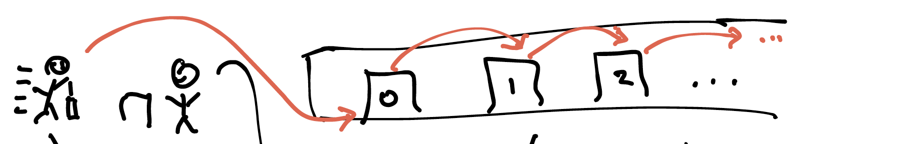
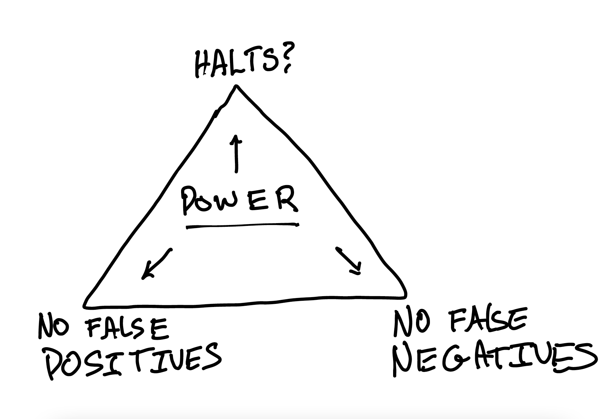

I want to tell you a story&mdash;with only _some_ embellishment. 

First, some context. How do we count things? Does ${1,2,3}$ have the same number of elements as ${A, B, C}$? What about $\mathbb{N}$ vs. $\mathbb{N} \cup \{BrownU\}$? If we're comparing infinite sets, then it seems reasonable to say that they have the same size if we can make a bijection between them: a 1-1 mapping. 

But then, counter-intuitively, $\mathbb{N}$ and $\mathbb{N} \cup \{BrownU\}$ are the same size. Why? The idea is encoded in a thought experiment called _Hilbert's Hotel_: suppose you work at the front desk of an infinite hotel. You have a guest room for every natural number. Tonight, every room is occupied. But then a new guest arrives. Can you find room for them?

??? note "Think, then click!"
    Yes! Here's how. For every room $i$, tell that guest to move into room $i+1$. You'll never run out of rooms, and room 0 will be free for the new guest. Every guest will need to do a finite amount of work, but assuming we can send this message to everyone at once, it works out.

    <!--  -->
    <center></center>

So, it's the late 1800's. Ideas like Hilbert's hotel have excited the mathematical world. The fervor is almost spiritual: can we use this trick to show that _every_ infinite set is the same size? Are all infinities one, in a philosophical sense?

At this time, moderately successful mathematician named Georg Cantor. He was in his 40's when he made a groundbreaking discovery&mdash;contradicting the conventional wisdom (thanks, Hardy) that young mathematicians do all the interesting work. **Cantor proved that the power set of $\mathbb{N}$, that is, the set of subsets of $\mathbb{N}$, must be strictly larger than $\mathbb{N}$.**

At the time, there is pandemonium. Later on, mathematicians said that his ideas came 100 years before the community was ready for them. Hilbert himself actually said, later, that ["No one shall drive us from the paradise Cantor has created for us."](https://en.wikipedia.org/wiki/Cantor%27s_paradise) A pretty ringing endorsement from one of the greatest then-living mathematicians.

How did Cantor prove this? By contradiction. Assume you're given a bijection between a set $\mathbb{N}$ and its power set. Now, this bijection can be thought of as an infinite table, with subsets of $N$ as rows and elements of $N$ as columns. The cells contain booleans: true if the subset (row) contains the element (column), and false if it doesn't. 

|   Set   | 0    | 1    | ...  |
| ------- | ---- | ---- | ---- | 
| {}      | N    | N    | ...  | 
| {0}     | Y    | N    | ...  | 
| {0, 1}  | Y    | Y    | ...  | 
| ...     | ...  | ...  | ...  | 
| \mathbb{N}  | Y    | Y    | ...  | 
| evens       | Y    | N    | ...  | 
| odds        | N    | Y    | ...  | 

Cantor showed that there must _always_ be a subset of $\mathbb{N}$ that _isn't_ represented as a row in the table. That is, such a bijection cannot exist. Even with the very permissive definition of "same size" we use for infinite sets, there are _still_ more subsets of the natural numbers than there are natural numbers. So: what is the subset that can't be represented as a row in the table?

??? note "Think, then click!"
    Read off the diagonal from the top-left onward, and invert each boolean. In the table above, the set would contain both 0 and 1 (because those first two rows do not contain them, respectively) and so on.

    This technique is called "Cantor diagonalization".

Why does this matter to *US*? Let me ask you two questions:

**QUESTION 1**: How many syntactically-valid Java program source files are there?

??? note "Think, then click!"
    There are infinitely many. But let's be more precise. The _source code_ of any program is a finite text file. The size may be _unbounded_, but that's not the same as infinite. And the alphabet used for each character is also finite (let's say between 0 and 255, although that isn't always entirely accurate). 

    Thus, we can think of a program source file as a finite sequence of numbers between 0 and 255. We can encode a Java program's code as a natural number! There cannot be more Java program source files than there are natural numbers.

**QUESTION 2**: How many mathematical functions from non-negative integer inputs to `bool` outputs are there, assuming your language has unbounded integers?

??? note "Think, then click!"
    Each such function returns true or false for any given non-negative integer. In effect, it is defining a specific set of numbers. There are as many such mathematical functions as there are _sets_ of natural numbers.

Try as you might, it is impossible to express every predicate on numbers in any programming language where program texts are finite. Any given language cannot express some mathematical concepts&mdash;indeed, the overwhelming majority of them!

!!! warning "It's not easily fixed."
    You might be tempted to say: let's just define many different programming languages. But think: how do we define a new programming language? Is each definition finite? Then consider the version of Hilbert's hotel where a new guest arrives for _every_ natural number.

In any case, programs have unavoidable limits to their expressive power. But maybe all the inexpressible things don't matter, because nobody actually needs or cares about them? 

That would be comforting. Unfortunately, it's not true.

!!! note "No, AI can't escape this problem."
    There's a lot of speculation about whether artificial intelligence will exceed our current capabilities. Personally, I think that the answer is "yes" in many ways&mdash;but not here. We're talking about a limit baked into mathematics itself. None of the popular-science speculation that I've seen (e.g., quantum computing) escapes this constraint. We'd need to somehow [move the barber out of town](https://en.wikipedia.org/wiki/Barber_paradox).

### Another Story: Halting

It's the early 1900's. Hilbert (him again) and many others are wondering whether the study of mathematics can be mechanized. Can we write a procedure that finds proofs for us? More precisely (using today's terms) is it possible to write a program that accepts a conjecture and:
    - always terminates in finite time; 
    - returns a proof if the conjecture holds; 
    - returns a counterexample if the conjecture doesn't hold. (Does this sound familiar?)

Then, in the 1930's, Kurt Gödel, Alonzo Church, Alan Turing, and others showed (using different methods) that the that the answer was no&mdash;at least, not completely. Here's a challenge.
  
Write for me a program `h(f, v)` that accepts two arguments:
    * another program (`f`); and
    * an input to that program (`v`).
It must:
    * always terminate;
    * return true IFF f(v) terminates in finite time; and
    * return false IFF f(v) does not terminate in finite time.

Suppose `h` exists, and can be embodied in whatever language we're using. Now we can write this other program:

```
def g(x):
  if h(g, x):
    while(1);
  else:       
    return;  
```

??? warning "Why is this program a problem?"
    For your convenience, I've added comments to `h`:
    ```
    def g(x):
        if h(g, x): # AM I MYSELF (g) GOING TO HALT? 
            while(1); # NUH UH, NO I'M NOT!
        else:       
            return;   # HAHAHAHAHA YES I AM
    ```

Argh! No matter how clever we are with `f`, `h` cannot exist. This is called the _halting problem_: it is impossible to write a program that (in finite time, without error) says whether another program terminates on a given input. 

??? note "What are consequences for us? It's OK to be philosophical or uncertain."
    It turns out that it's impossible to write an always-terminating, always-correct oracle for an arbitrary program's behavior&mdash;if the two languages have the same expressive power. This leads to what I call the Triangle of Existential Despair:
    <center></center>
    If we want to analyze programs, we need to give up one of these 4 requirements.

### What Does This Have To Do With SMT?

Gödel also proved that number theory is undecidable: if you've got the natural numbers, multiplication, and addition, it is impossible to write an algorithm that answers _arbitrary_ questions about number theory in an _always correct_ way, in _finite_ time.

There are also tricks you'll learn in 1010 that let you say "Well, if I could solve arbitrary questions about number theory, then I could turn the halting problem into a question about number theory!"

There's so much more I'd like to talk about, but this lecture is already pretty disorganized, so I'm not going to plan on saying more today.


